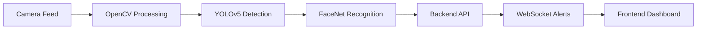

# 🚀 ATM-GuardAI  
### 🎥 AI-Powered ATM Surveillance System 🔒  

  
  
  
  
  

  <b>Real-time AI Surveillance for ATM Security using Deep Learning & Computer Vision</b>

---

## 📌 Overview

**ATM-GuardAI** is an intelligent AI-powered surveillance system designed to enhance ATM security.  
It detects suspicious activities in real-time and instantly alerts security personnel.

### 🔍 Detection Capabilities
- 🪖 Helmet Detection (Robbery indicator)
- 😷 Mask Detection (Disguise detection)
- 👤 Face Recognition (FaceNet)
- ⚠️ Suspicious Activity Alerts

---

## 🎥 Demo

  

---

## 📸 Screenshots

  
  
  
  
  
  
  

---

## 🧠 System Architecture

---

## 🛠️ Technologies and Tools Used

### 🤖 Artificial Intelligence & Computer Vision
- TensorFlow – Deep learning framework  
- OpenCV – Computer vision and video processing  
- YOLOv5 – Object detection  
- FaceNet – Face recognition  

### 🐍 Programming Language (AI/ML Service)
- Python 3.11  

### 💻 Backend
- Node.js  
- Express.js  
- MongoDB  

### 🌐 Frontend
- React.js  
- Vite  
- Tailwind CSS  

### 🔐 Authentication & Security
- JWT (JSON Web Token)  
- bcryptjs  

### ⚡ Real-time Communication
- WebSocket (Socket.IO)  
- MJPEG Streaming  

---

## 🚀 Features

- 🔥 Real-time video processing  
- ⚡ Instant alert system  
- 🎯 High accuracy detection using YOLOv5  
- 🔐 Secure authentication system  
- 💡 Modern and responsive UI  
- 📡 Live streaming dashboard  
